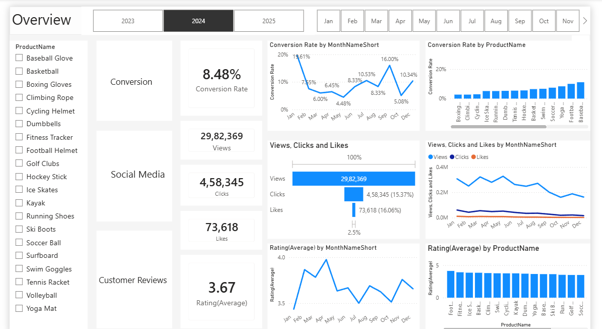
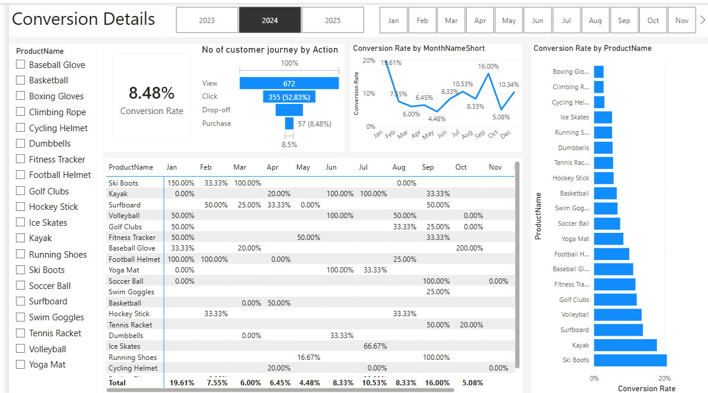
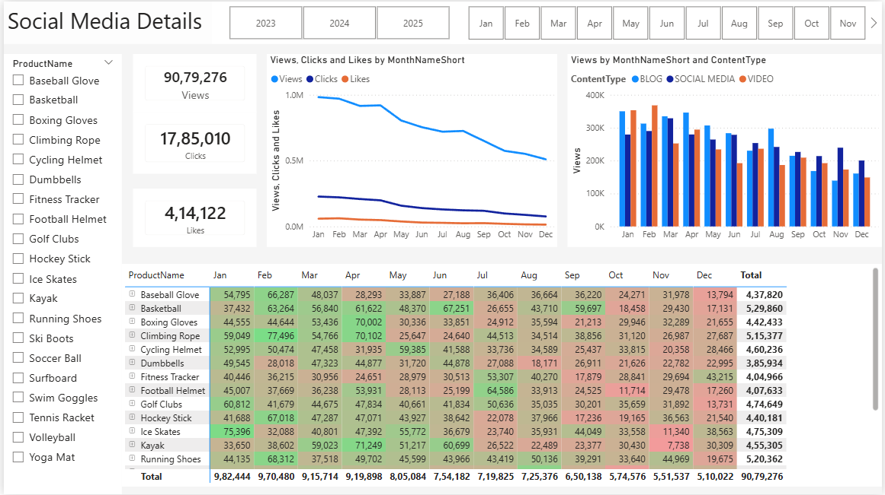
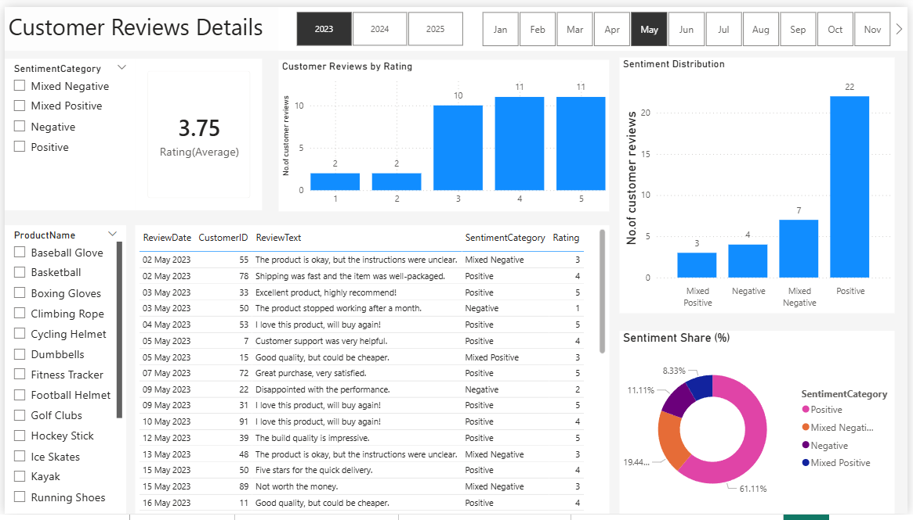

# 📊 Customer Insights Marketing Analytics

🚀 A complete **end-to-end data analytics project** using **SQL, Python, and Power BI** to analyze customer behavior, marketing performance, and sentiment trends.

---

## 🎯 Project Objective

The goal of this project is to:

* Understand customer behavior and journey
* Measure marketing performance using conversion rates
* Perform sentiment analysis on customer reviews
* Build an interactive dashboard for business insights

---

## 🛠️ Tech Stack

| Tool                  | Purpose                          |
| --------------------- | -------------------------------- |
| SQL Server            | Data extraction & transformation |
| Python (Pandas, NLTK) | Sentiment analysis               |
| Power BI              | Data visualization               |
| Git & GitHub          | Version control                  |

---

## 📂 Project Structure

```
data/            → Raw data  
sql/             → SQL scripts  
python/          → Sentiment analysis code  
outputs/         → Processed CSV files  
powerbi/         → Dashboard (.pbix) + images  
presentation/    → Business case PPT  
README.md  
```

---

## 📊 Dashboard Preview

### 🔹 Overview Dashboard



---

### 🔹 Conversion Analysis



---

### 🔹 Social Media Insights



---

### 🔹 Customer Reviews & Sentiment



---

## 🔍 Key Insights

* ⭐ Higher ratings strongly correlate with positive sentiment
* 📈 Majority of customers give 4–5 star ratings
* 💬 Positive sentiment dominates customer reviews
* 📊 Conversion rates vary across products and time

---

## 📈 Features

* ✔ Conversion rate analysis
* ✔ Sentiment analysis using VADER (NLP)
* ✔ Interactive Power BI dashboard
* ✔ Customer journey analysis

---

## ▶️ How to Run

1. Run SQL scripts to create and load data
2. Execute Python script for sentiment analysis
3. Load processed data into Power BI
4. Open `.pbix` file to explore dashboard

---

## 👤 Author

**Om Shukla**
📌 Aspiring Data Analyst

---

## ⭐ If you like this project

Give it a ⭐ on GitHub and share your feedback!

---
